# Perfect-loop-gif using Neural Radiance Fields (NeRF)  
A perfect-loop-gif is a gif where the transition between the first and last frame is done smoothly enough the naked eye can't distinguish where the series of images begin and end. The action in the gif appears to be repeated instead of played back.  
The aim of this project is to create a *perfect-loop-gif* with the help of a neural radiance fields technique.  
  
Example of a *perfect-loop-gif*:  

  

Example of a *jumpy-gif*:  
*notice how the end frame "jumps" to the first.  

  

# Data 
The objects used in this project are either scenes taken from the dataset: https://ai.meta.com/datasets/CO3D-dataset/ or photos I've taken with my smartphone.   
(Notice the jumpiness in the gif below)    

  

The "jump" in frames happens because the camera position (position of the person capturing photos around the object) at the first frame and the last frame are not identical. Meaning, the person didn't return to the starting point (see camera positions below), which is what we fix in this project.

# Approach 
  
To create the *perfect-loop-gif* using NeRF, we follow these steps:  
1) Extract images from the gif.  
   Since a gif is a series of images, we can extract and save them as individual images.
2) Calculate the camera position for each image. We use colmap for that (Colmap is a structure from motion framework that generates camera positions for a given series of images).   
3) Train NeRF on the extracted images (+ generated camera positions).
   For this step, we use the TensoRF framework to train NeRF on the specific scene (object).  
4) Create/fix the camera path (camera positions) to be a closed circle around the object where the first and last position are the same.  
5) Run the trained nerf network on the new/fixed path to generate new images.  
6) Create a new gif from the new generated images.

**1. Extracting images from gif**

  

**2. Camera Positions**  
We used Colmap to generate camera positions for extracted images.
Below is a visualization of the camera positions around the object (number of frame is next to the point in black).  
The blue points represent the path that the person recording is taking around the object - assume object is placed at (0,0,0).  
You can see clearly that the person holding the camera circled the object for more than 360 degrees. Meaning, The person did not return to the starting point.  
Also, the Z axis shows that the person is moving up and down while capturing the video.   

  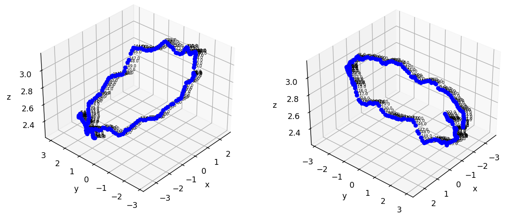

**3. NeRF: Neural Radiance Fields**  
For this part, we had the freedom to use any variation of NeRF.  
We chose TensoRF: https://apchenstu.github.io/TensoRF/    
The reason we chose this one is because the pytorch implementation is very clear and the run-time is short.   
The training PSNR is 37.451 (the images are very good and no floating noise around the object).  

We also ran Instant-ngp and the result is good. It is definetly another way to go.  

  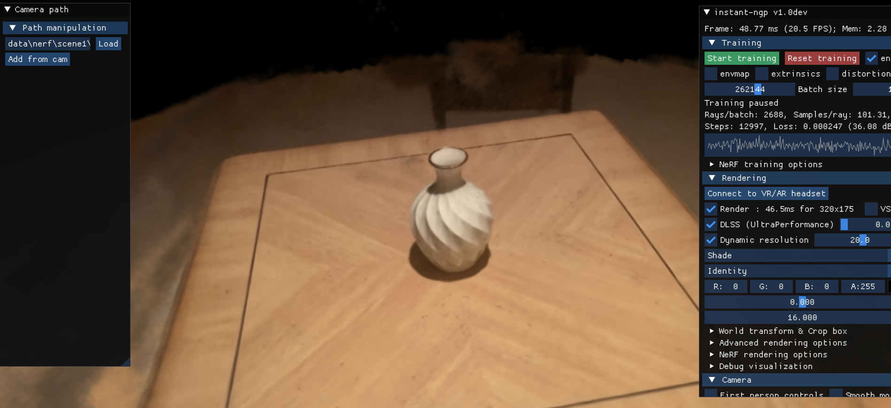

**4. New camera positions**   
After training the NeRF model on the scene, we use it to generate images to help create a perfect-loop GIF.  
For this purpose, we need a new camera path (points of view) where the starting point and the end point are the same.

A top-view of the given camera path (assume object at (0,0))

  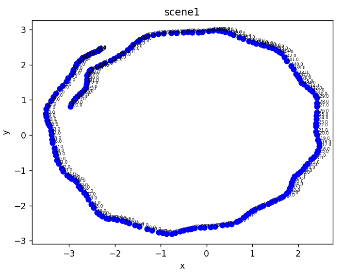

We implemented two methods of creating a closed camera path:  

*cool addition*   
The code has a camera visualizer which plots the camera plane with it's rotation and position (not just position as above).  

  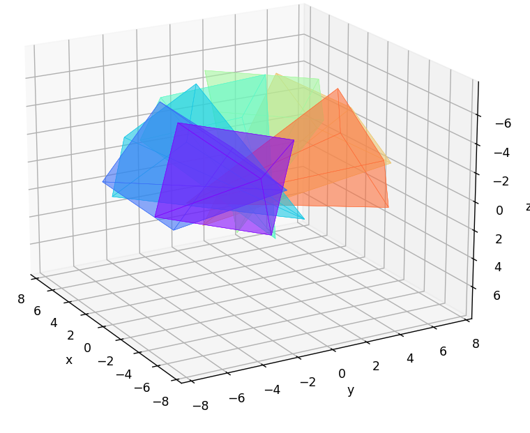
  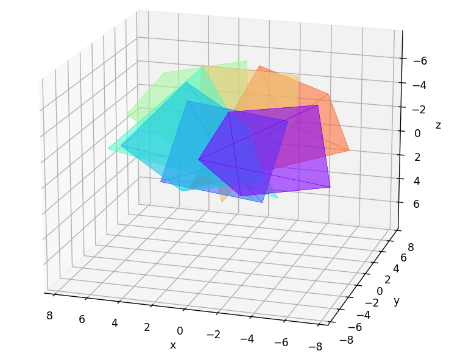
  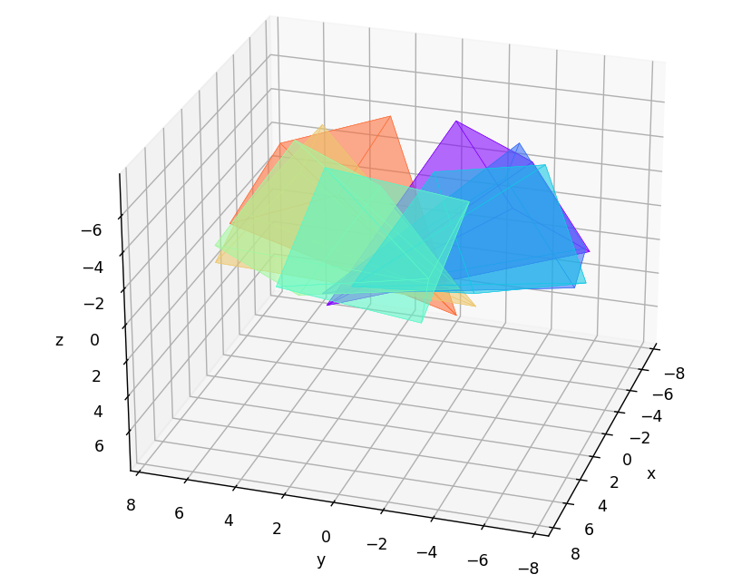
  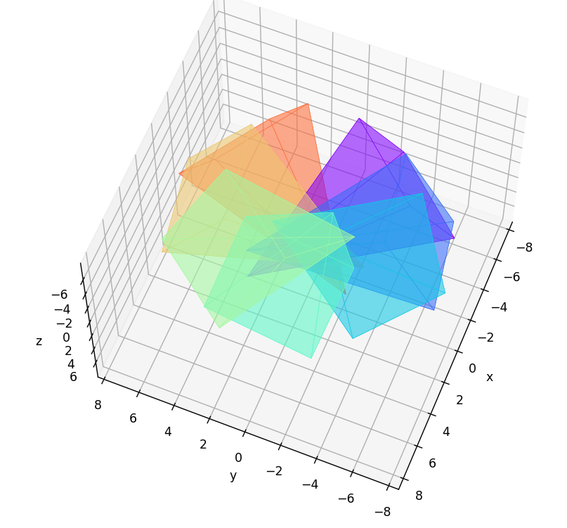

   
**4.1 fixing the existing camera path**  
Fixing the path means utilizing most of the given camera positions and image. To close the path we do the following: 
1) Find the overlap point in the camera path:  
   Meaning, find the point where the person completed a 360 degree circle around the object.  
   Figure (a) shows the overlap point in red.  
2) Ignore all position after the overlap point.  
   Every position of camera after it completed a 360 degree is not relevant. Figure (b) shows those positions in red.  
   Also, we added some margin and Ignored positions before and after the overlapping point. Figure (b) shows the margin in yellow.  
   After this step, we have a circling path around the object missing some positions.  
3) In those missing positions in the circle shown missing in figure (c), we will create new camera positions (shown in green in figure (d)) and generate images there so that the transition is smooth between start and finish.   
  

  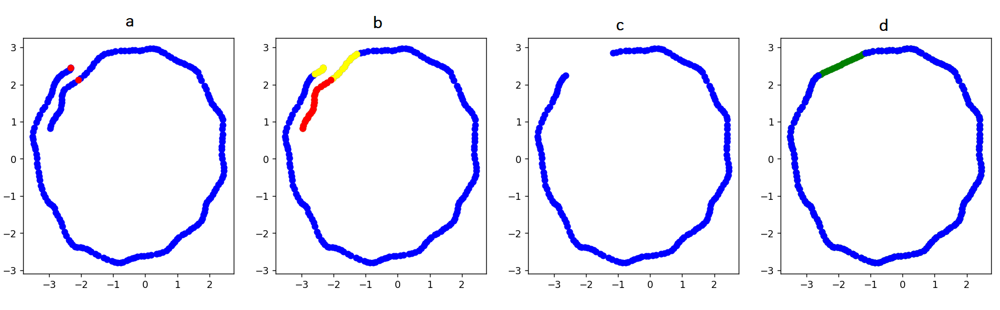

   
**Linear and curve fitting**  
We've added the ability to fit a curve to complete the camera path:   

  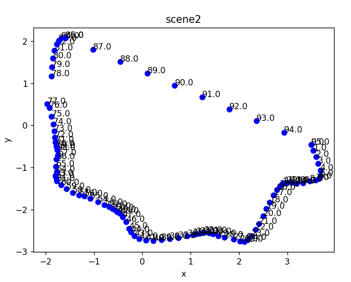
  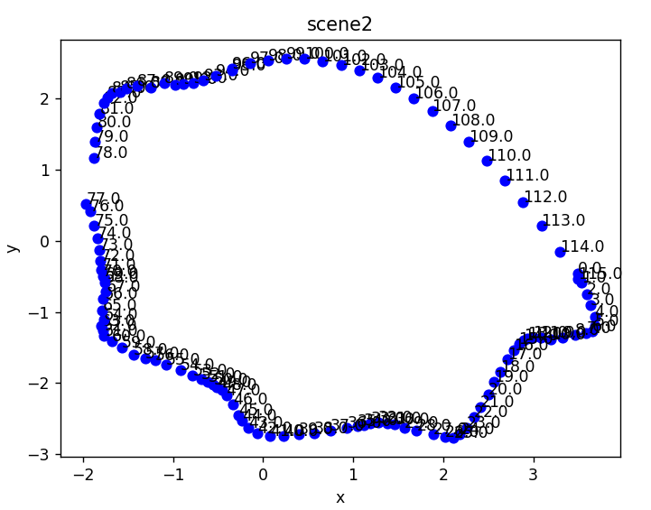

from left to right: original, linear path, curve fit path.   

  
  
  

  
**4.2 New generic camera path**  
Another way to go is to ignore the whole camera path given and simply sample 360 camera positions in a steady circle around the object.   
This creates a more smooth path than before because the camera positions are uniformly distributed and at the same height.

  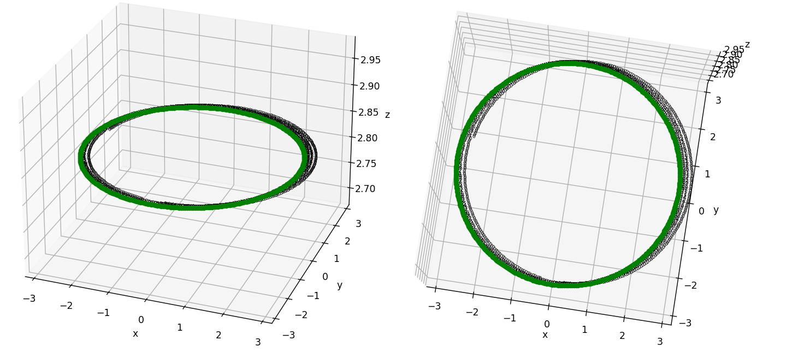

**5. Generating new images from the new camera positions**  
We use the trained model to generate new images at given camera positions.   
In 4.1, we created only 20 camera positions and hence 20 new images.  
In 4.2, we created 360 camera position. Generating all 360 images around the object.  

  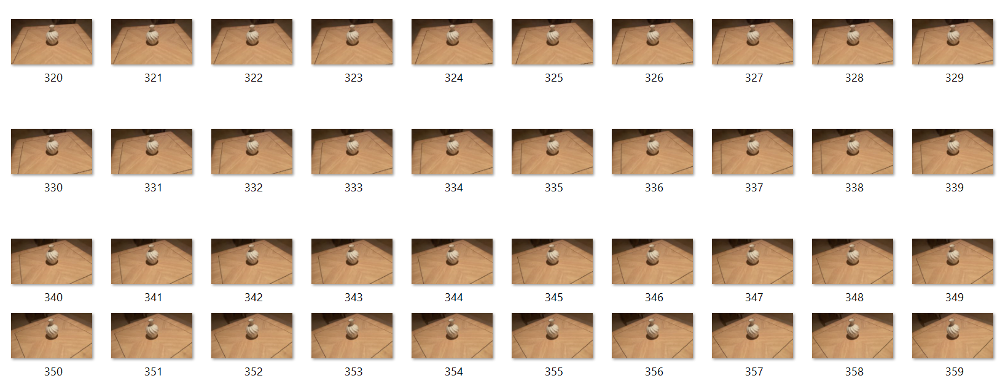

**6. New gif**  
Putting together the generated images to create a perfect-loop gif.   

Fixing the existing path:  

  

New generic path (unifrom 360):    

  

**7. More examples and limitations**  
*Left: original. Right: corrected*

  
  

I've taken photos with my phone (therefore, there are fewer images and the transitions might be less smooth):   

*Pay attention to the pyramid's color transition*      

  
  

  
  
*Very detailed scenes are harder for image generation.*   
*Generated images might lack information or be more blurred:*  

  
  

*In the following example, part of the room was not seen in training. therefore, some distorion happened to the generated images:*   

  
  

# References  
[https://apchenstu.github.io/TensoRF/  
](https://github.com/apchenstu/TensoRF)

[https://github.com/NVlabs/instant-ngp
](https://github.com/NVlabs/instant-ngp)https://github.com/NVlabs/instant-ngp

