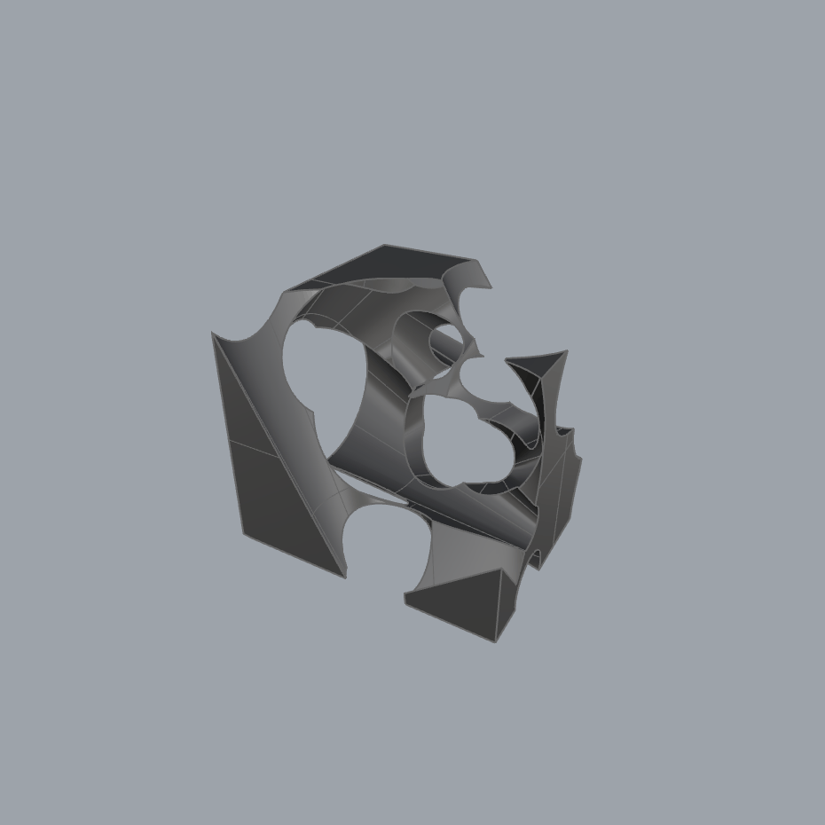

# Perfect-loop-gif using Neural Radiance Fields (NeRF)  
A perfect-loop-gif is a gif where the transition between the first and last frame is done smoothly enough the naked eye can't distinguish where the series of images begin and end. The action in the gif appears to be repeated instead of played back.  
The aim of this project is to create a *steady perfect-loop-gif* with the help of a neural radiance fields technique.  
  
Example of a perfect loop gif:  

  

# Data 
The objects used in this project are scenes taken from the dataset: https://ai.meta.com/datasets/CO3D-dataset/   
Notice how at the end of the gif the last frame "jumps" to the first.  

  

The "jump" in frames happens because the camera position (position of the person capturing photos around the object) at the first frame and the last frame are not identical. Meaning, the person didn't return to the starting point - see camera positions below.

# Approach 
  
To create the *perfect-loop-gif* using NeRF, we follow these steps:  
1) Extract images from the gif.  
   Since a gif is a series of images, we can extract and save them as individual images.
2) Calculate the camera position for each image. We use colmap for that (Colmap is a structure from motion framework that generates camera positions for a given series of images).   
3) Train NeRF on the extracted images (+ generated camera positions).
   For this step, we use the TensoRF framework to train NeRF on the specific scene (object).  
4) Create a new camera path (new camera positions).
   To create a steady smooth gif, we create a camera path (positions) that surround the object in a steady way.   
5) Run trained nerf network on the new path to generate new images to match the new camera path.  
6) Create a new gif from the new generated images.

**1. Extracting images from gif**

  

**2. Camera Positions**  
We used Colmap to generate camera positions for extracted images.
Below is a visualization of the camera positions around the object (number of frame is next to the point in black).  
The blue points represent the path that the person recording is taking around the object - assume object is placed at (0,0,0).  
You can see clearly that the person holding the camera is moving more than a 360deg around the object. Meaning, the person is not returning to the origin point.  
Also, the Z axis shows that the person is moving up and down while capturing the video.   

  

**3. NeRF: Neural Radiance Fields**  
For this part, we had the freedom to use any variation of NeRF.  
We chose TensoRF: https://apchenstu.github.io/TensoRF/    
The reason we chose this one is because the pytorch implementation is very clear and the run-time is short.   
The training PSNR is 37.451 (the images are very good and no floating noise around the object).  

We also ran Instant-ngp and the result is good. It is definetly another way to go.  

  

**4. New camera positions**   
After training the model on the scene, we want to generated new images.  
For this purpose, we need a new camera path (points of view) to create a smooth path for the gif where the first and last frame are identical.

A top-view of the camera path (assume object at (0,0))

  

We implemented two methods of creating a closed camera path:  
**4.1 fixing the existing camera path**  
What we mean by fixing the existing path is: 
1) find the overlap point in the camera positions 
2) delete all position after the overlap (in addition to some margin as well).
3) create new position in the missing path.

Left image: the red point marks the overlapping point.
Middle image: In red, we see the overlapping camera path that is ignored. In yellow, we also ignore a margin of position in order to create a more smooth path.
Right image: new position replaced the red/yellow positions. For those positions, new images will be generated.

  

   

**4.2 New generic camera path**  
Another way to go is to ignore the whole camera path given and simply sample 360 camera positions in a steady circle around the object.   
This creates a more smooth path than before because the camera positions are uniformly distributed and at the same height.

  

**5. Generating new images from the new camera positions**  
We use the trained model to generate 360 images from 360 angles around the object:  

  

**6. New gif**  
Putting together the generated images to create a perfect-loop gif.   

Fixing the existing path:  

  

New generic path (unifrom 360):    

  

# References  
[https://apchenstu.github.io/TensoRF/  
](https://github.com/apchenstu/TensoRF)

[https://github.com/NVlabs/instant-ngp
](https://github.com/NVlabs/instant-ngp)https://github.com/NVlabs/instant-ngp

