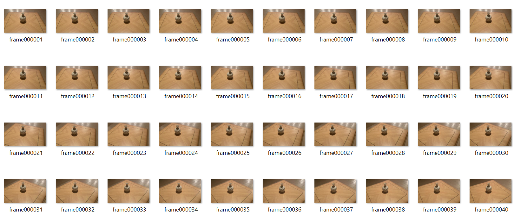

# Perfect-loop-gif-nerf  
A perfect loop gif is a gif where the transition between the first and last frame is done smoothly enough the naked eye can't distinguish where the series of image begin and end. The action in the gif appears to be repeated instead of played back.  
The aim of this project is to create a steady perfect loop gif using a neural radiance fields technique.  
example of a perfect loop gif:  

  

# Data 
Scenes were taken from the dataset: https://ai.meta.com/datasets/CO3D-dataset/   
Notice the end of the gif, the last frame "jumps" to the first.  

  

# Approach 
  
Since a gif is a series of images, to utilize nerf, we need to:  
1) Extract images from the gif.
2) Calculate the camera position for each image (we use colmap for that).
3) Train nerf on the extracted images (+ generated camera positions).
4) Create a new view path (new camera positions).
5) Run trained nerf network on the new path to generate new images
6) Create a new gif from the new images.

**1. Extracting images from gif**

  

**2. Camera Positions**  
We used Colmap to generate camera positions for extracted images.
Below is a visualization of the camera positions around the object (number of frame is next to the point in black).  
The blue points represent the path that the person recording is taking around the object - assume object is placed at (0,0,0).  
You can see clearly that the person holding the camera is moving more than a 360deg around the object. Meaning, the person is not returning to the origin point.  
Also, the Z axis shows that the person is moving up and down while capturing the video.   

  

**3. NeRF: Neural Radiance Fields**  
For this part, we had the freedom to use any variation of NeRF.  
We chose TensoRF: https://apchenstu.github.io/TensoRF/    
The reason we chose this one is because the pytorch implementation is very clear and the run-time is short.   
The training PSNR is 37.451 (the images are very good and no floating noise around the object).  

We also ran Instant-ngp and the result is good. It is definetly another way to go.  

  

**4. New camera positions**  
After training the model on the scene, we want to generated new images.  
For this purpose, we need new camera positions (points of view) to create a smooth path for the gif.   
We sample 360 camera positions (The green points - which seem continuous because there's a large number of points) placed in a steady circle around the object.  

  

**5. Generating new images from the new camera positions**  
We use the trained model to generate 360 images from 360 angles around the object:  

  

**6. New gif**  
Putting together the generated images to create a perfect-loop gif.   

  

# References  
[https://apchenstu.github.io/TensoRF/  
](https://github.com/apchenstu/TensoRF)

[https://github.com/NVlabs/instant-ngp
](https://github.com/NVlabs/instant-ngp)https://github.com/NVlabs/instant-ngp

