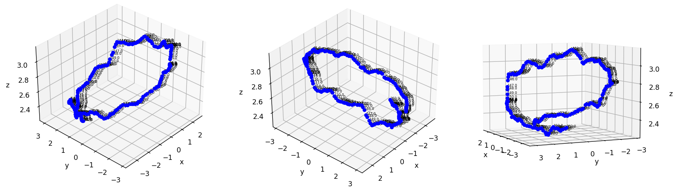

# Perfect-loop-gif-nerf
The target of this project is to create a perfect loop gif using a neural radiance fields technique.  
example of a perfect loop gif:  

  

# Data 
Scenes were taken from the dataset: https://ai.meta.com/datasets/CO3D-dataset/   
Example: (notice the end of the gif) 

  

# Approach 
  
Since a gif is a series of images, to utilize nerf, we need to:  
1) extract images from the gif.
2) generate camera position for each image (we use colmap for that).
3) train nerf on the extracted images (+ generated camera positions).
4) create a new path (new camera positions), those will be our test set.
5) run trained nerf network on the new path to generate new images
6) create a new gif from the new images.

**Extracting images from gif**

  

**Camera Positions**  
We used Colmap to generate camera positions for extracted images.
This is a visualization of the camera positions around the object (the path that the person recording is doing around the object - assume object is placed at (0,0,0).   
You can see clearly that the person holding the camera is moving more than a 360deg around the object. Meaning, the person is not returning to the origin point.  
Also, the Z axis shows that the person is moving up and down while capturing the video.   

  

**NeRF: Neural Radiance Fields**  
For this part, we had the freedom to use any variation of NeRF.  
We chose TensoRF: https://apchenstu.github.io/TensoRF/    
The reason we chose this one is because the pytorch implementation is very clear and the run-time is short.   
The training PSNR is 37.451 (the images are very good and no floating noise around the object).  

**New camera positions**
After training the model on the scene, we want to generated new images. For this purpose, we need new camera positions (points of view) to create a smooth path for the gif.   
We sample 360 camera position ordered in a circle around the object. From them, 360 images are generated using the trained model.  

  

